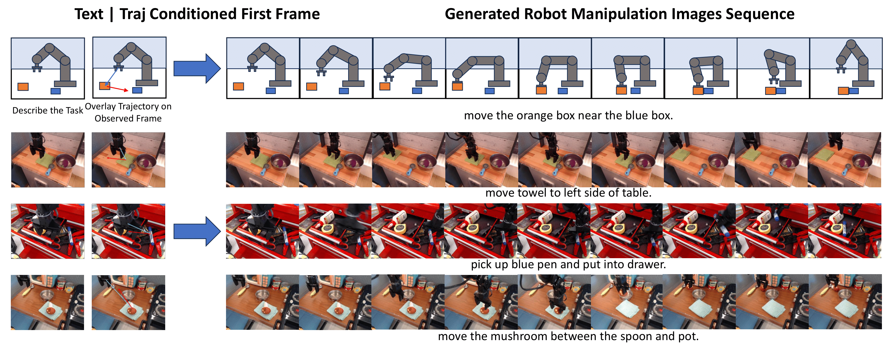
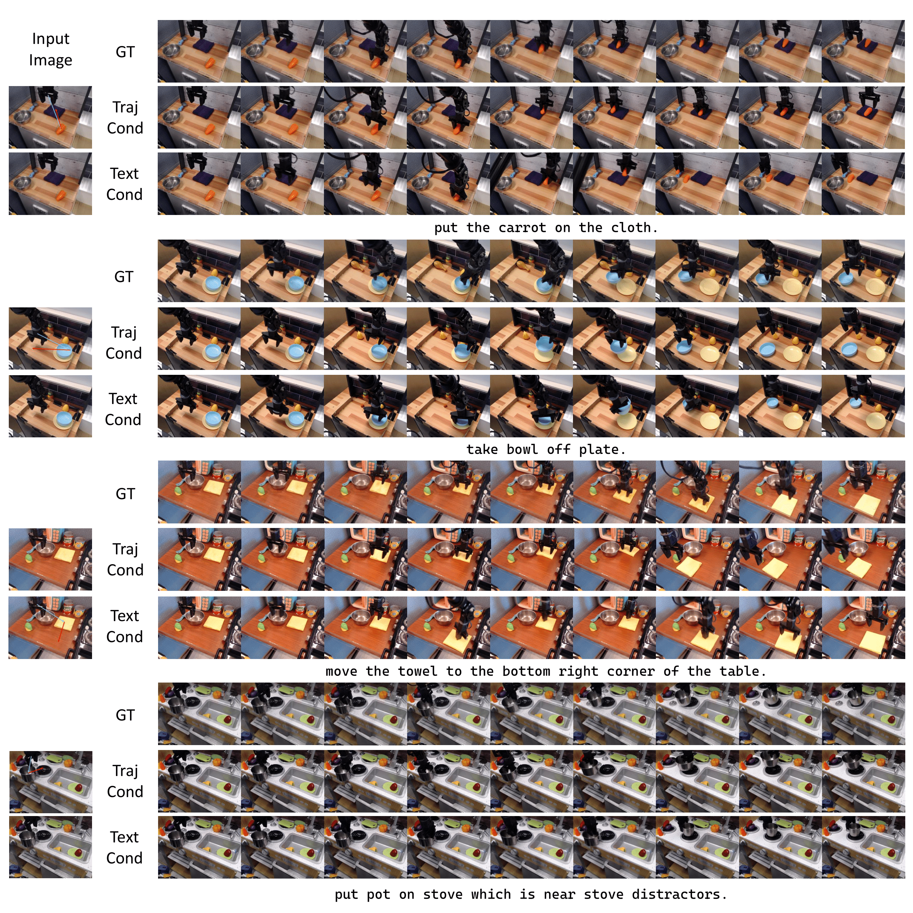

# PlanGen: Image Generation as a Visual Planner for Robotic Manipulation

> **Image Generation as a Visual Planner for Robotic Manipulation**
> <br>
> [Pang Ye](https://scholar.google.com/citations?view_op=list_works&hl=zh-CN&user=KRO1nv0AAAAJ)  
> South China University of Technology  
> <br>

<!-- Badges (links to be filled later) -->
<a href=""></a>
<a href=""></a>
<a href=""></a>

<br>



## Quick Start
### Configuration
#### 1. **Environment setup**
```bash
git clone https://github.com/pangye202264690373/Image-Generation-as-a-Visual-Planner-for-Robotic-Manipulation.git
cd Image-Generation-as-a-Visual-Planner-for-Robotic-Manipulation

conda create -n PlanGen python=3.11.10
conda activate PlanGen
```
#### 2. **Requirements installation**
```bash
pip install torch==2.5.1 torchvision==0.20.1 torchaudio==2.5.1 --index-url https://download.pytorch.org/whl/cu124
pip install --upgrade -r requirements.txt
```


### 2. Inference
We provided the integration of diffusers pipeline with our model and uploaded the model weights to huggingface, it's easy to use the our model as example below:

```bash
from src.pipeline_pe_clone import FluxPipeline
import torch
from PIL import Image

pretrained_model_name_or_path = "black-forest-labs/FLUX.1-dev"
pipeline = FluxPipeline.from_pretrained(
    pretrained_model_name_or_path,
    torch_dtype=torch.bfloat16,
).to('cuda')

pipeline.load_lora_weights("yio-ye2004/lora_collection", weight_name="pretrain.safetensors")
pipeline.fuse_lora()
pipeline.unload_lora_weights()

pipeline.load_lora_weights("yio-ye2004/lora_collection", weight_name="bridge_clean_pytorch_lora_weights.safetensors")

height=768
width=512

validation_image = "assets/1.png"
validation_prompt = "add a halo and wings for the cat by sksmagiceffects"
condition_image = Image.open(validation_image).resize((height, width)).convert("RGB")

result = pipeline(prompt=validation_prompt, 
                  condition_image=condition_image,
                  height=height,
                  width=width,
                  guidance_scale=3.5,
                  num_inference_steps=20,
                  max_sequence_length=512).images[0]

result.save("output.png")
```

or simply run the inference script:
```
python inference.py
```

### 3. Train

#### 3.1 Get data from huggingface dataset
```
huggingface-cli download --repo-type dataset --local-dir data yio-ye2004/lora_collection
```

#### 3.2 Get pretrained model for edit-lora trainning
```
python merge_pretrain.py
```

#### 3.3 Train!
```
bash train_bridge_clean.sh
```

For personalized robotic datasets, please check the data folder and orgnize data like ours.


### 4. Weights
You can download the trained checkpoints of PlanGen for inference. Below are the details of available models, checkpoint name are also trigger words.

You would need to load and fuse the `pretrained ` checkpoints model in order to load the other models.

|                           **Model**                           |                      **Description**                      | **Resolution** |
| :-----------------------------------------------------------: | :--------------------------------------------------------: | :------------: |
| [pretrained](https://huggingface.co/yio-ye2004/lora_collection/blob/main/pretrained.safetensors) |                 Base LoRA for PlanGen                 |                |
| [bridge_clean](https://huggingface.co/yio-ye2004/lora_collection/blob/main/bridge_clean_pytorch_lora_weights.safetensors) |         LoRA trained on `bridge_clean`         |                |
| [bridge_traj](https://huggingface.co/yio-ye2004/lora_collection/blob/main/bridge_traj_pytorch_lora_weights.safetensors) |         PlanGen LoRA trained on `bridge_traj`         |                |
| [jocoplay_clean](https://huggingface.co/yio-ye2004/lora_collection/blob/main/jocoplay_clean_pytorch_lora_weights.safetensors) |       PlanGen LoRA trained on `jocoplay_clean`        |                |
| [jocoplay_traj](https://huggingface.co/yio-ye2004/lora_collection/blob/main/jocoplay_traj_pytorch_lora_weights.safetensors) |        PlanGen LoRA trained on `jocoplay_traj`        |                |
| [rt1_clean](https://huggingface.co/yio-ye2004/lora_collection/blob/main/rt1_clean_pytorch_lora_weights.safetensors) |          PlanGen LoRA trained on `rt1_clean`          |                |
| [rt1_traj](https://huggingface.co/yio-ye2004/lora_collection/blob/main/rt1_traj_pytorch_lora_weights.safetensors) |          PlanGen LoRA trained on `rt1_traj`           |                |


### 5. Dataset
<span id="dataset_setting"></span>
#### 2.1 Settings for dataset
The training process uses a paired dataset stored in a .jsonl file, where each entry contains image file paths and corresponding text descriptions. Each entry includes the source image path, the target (modified) image path, and a caption describing the modification.

Example format:

```json
{"source": "path/to/source.jpg", "target": "path/to/modified.jpg", "caption": "Instruction of modifications"}
{"source": "path/to/source2.jpg", "target": "path/to/modified2.jpg", "caption": "Another instruction"}
```


### 6. Results




### 7. Acknowledgments  

1. Thanks to **[Show Lab](https://github.com/showlab/photodoodle)** for providing the code base.  
2. Thanks to **[Diffusers](https://github.com/huggingface/diffusers)** for the open-source project.


